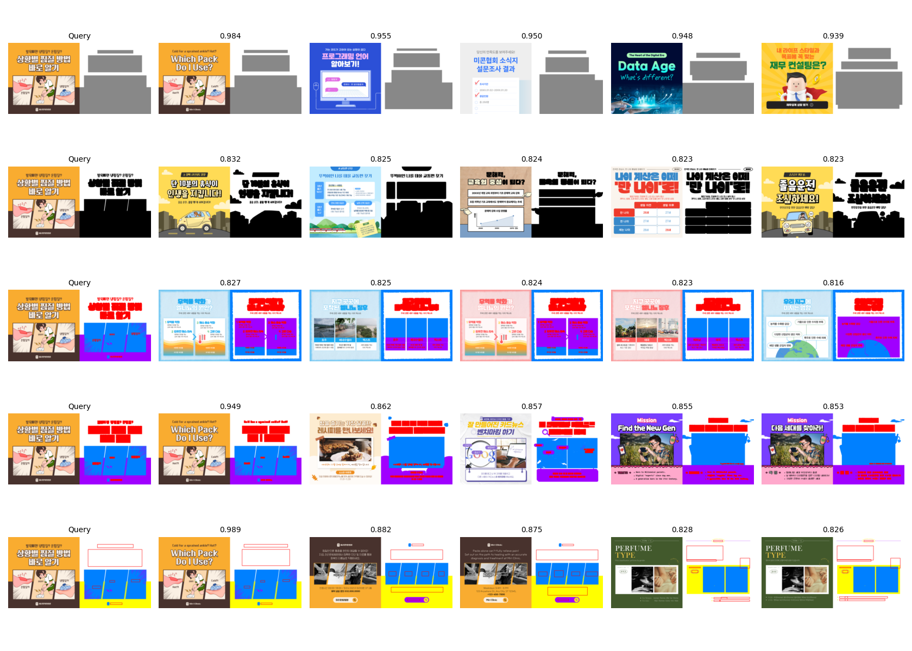
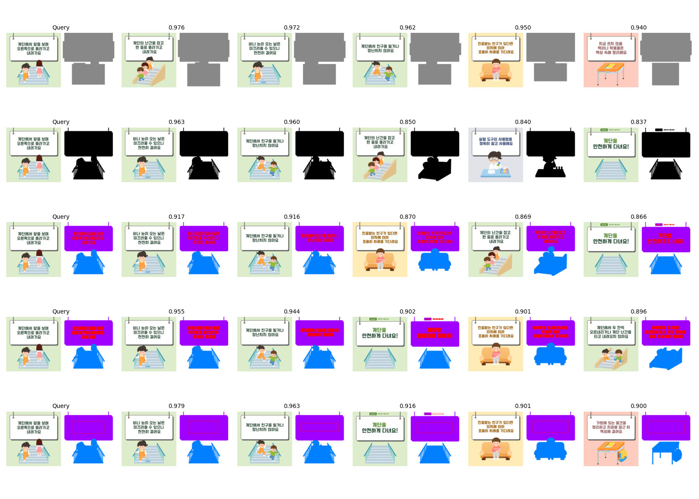
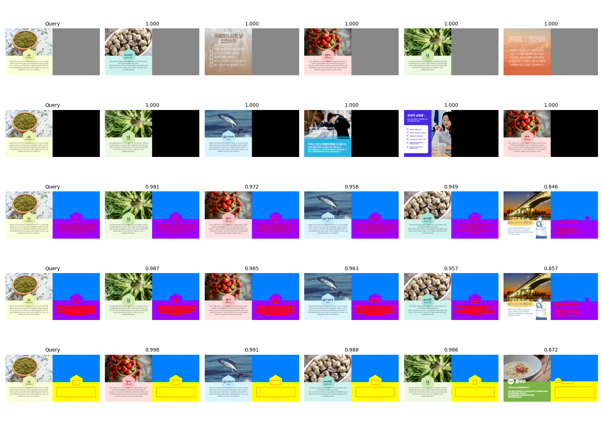

# 🖼️ Silhouette Comparison (V1 ~ V5)

이 프로젝트는 카드뉴스(`card_news`) 템플릿에 대해 V1부터 V5까지의 실루엣 생성 방식을 비교하고,
DreamSim 임베딩을 활용하여 버전별 유사도를 시각적으로 비교하는 시스템입니다.

---

## 📊 Example Results

아래는 V1~V5 버전 실루엣 비교 예시입니다.

<p align="center">
  <br>
  <br>
  <br>
</p>

---

## 📂 Repository Structure

```
.
├── v1_margin.py                # V1 실루엣 생성
├── v2_margin.py                # V2 실루엣 생성
├── v3_margin.py                # V3 실루엣 생성
├── v4_margin.py                # V4 실루엣 생성
├── v5_margin.py                # V5 실루엣 생성
├── visualize_silhouettes.py   # V1~V5 DreamSim 비교
├── template_info.csv           # 템플릿 메타데이터
├── result_images/              # 비교 결과 저장 폴더
│   ├── result_1.png
│   ├── result_2.png
│   ├── result_3.png
└── README.md
```

---

## 🚀 Usage

### 1️⃣ 실루엣 생성
```bash
python silhouette_v1.py
python silhouette_v2.py
python silhouette_v3.py
python silhouette_v4.py
python silhouette_v5.py
```

### 2️⃣ V1~V5 DreamSim 비교
```bash
python visualize_silhouettes.py
```

---

## 🛠 Requirements

```bash
pip install pandas pillow tqdm opencv-python numpy torch torchvision matplotlib dreamsim
```

---

## 📌 Notes
- `template_info.csv` 파일에는 `template_idx`, `page_num`, `image_type`, `full_image_path` 등의 정보가 포함되어야 합니다.
- 각 버전별 실루엣 이미지는 `/data/shared2/jjkim/margin_vX` 형식의 폴더에 저장됩니다.
- `compare_v1_v5_dreamsim.py` 실행 시 `result_images/` 폴더에 비교 결과가 생성됩니다.

---

## 📜 License
MIT License
